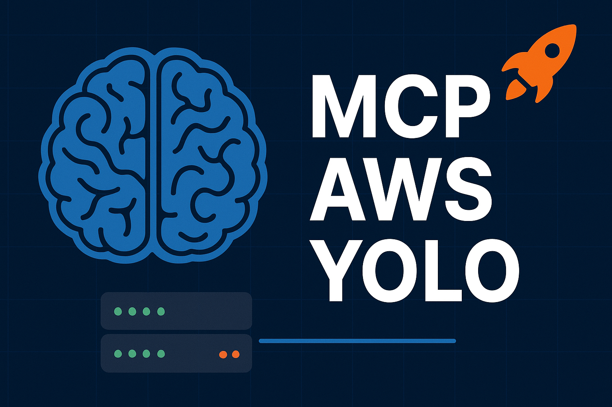

# MCP AWS YOLO

An open-source, **locally-hosted AI platform** that intelligently routes user prompts to the most appropriate MCP (Model Context Protocol) servers using LLM analysis and vector store similarity matching.

## Demo

Watch MCP AWS YOLO in action - intelligent routing from user prompts to AWS operations (it's quite slow because the local LLM runs on CPU):


[](https://www.youtube.com/watch?v=SlfYOZFtAdk)


*Demo shows: Natural language prompt → Intelligent server selection → AWS S3 bucket creation*

### What you'll see in the demo:
1. **User Query**: "create a s3 bucket named brian-yolo-000000, use aws-yolo"
2. **Intent Analysis**: MCP AWS YOLO analyzes the prompt using LLM + vector search
3. **Server Selection**: Automatically routes to `awslabs.aws-api-mcp-server`
4. **Parameter Resolution**: Resolves AWS credentials and region from `aws_config.json`
5. **Tool Execution**: Executes `call_aws` tool with `aws s3 mb` command
6. **Result**: S3 bucket created successfully with detailed response

## Prerequisites

Before setting up MCP AWS YOLO, ensure you have the following installed:

### Required
- **Python 3.10+** - Core runtime environment
- **uv package manager** - Fast Python package manager
  ```bash
  curl -LsSf https://astral.sh/uv/install.sh | sh
  ```
- **Docker & Docker Compose** - For infrastructure services (Qdrant vector database)
- **Ollama** - Local LLM inference server
  ```bash
  # Install Ollama
  curl -fsSL https://ollama.com/install.sh | sh
  ```

### AWS Prerequisites (for AWS MCP servers)
- **AWS CLI** configured with credentials
  ```bash
  pip install awscli
  aws configure
  ```
- **Valid AWS Account** with appropriate IAM permissions
- **AWS Profile** configured (default or named profile)

### Optional
- **Git** - For cloning and version control

## Features

### 🎯 Intelligent Server Routing
- **Automatic route to the best matched MCP server using hybrid search**
  - **Vector Store Search**: Semantic similarity matching using Qdrant and all-minilm embeddings
  - **LLM Validation**: GPT-OSS 20B model analyzes candidates and selects the optimal server
  - **Confidence Scoring**: Each match includes similarity scores and LLM confidence ratings
  - **Fallback Logic**: Expanded keyword searches when initial queries return no results

### ⚙️ Automatic Parameter Resolution
- **Automatic resolve parameters when running MCP server using aws_config.json**
  - **Template Processing**: Automatically replaces `{{env:param_name}}` placeholders in MCP server configurations
  - **AWS Configuration**: Centralized config file (`aws_config.json`) for all AWS-related parameters
  - **Environment Management**: Supports multiple AWS profiles, regions, and security settings
  - **Empty Parameter Filtering**: Automatically removes empty arguments and environment variables

## Architecture

MCP AWS YOLO acts as an intelligent routing layer between AI clients and MCP servers, combining semantic search with LLM-powered decision making.

### Architecture Diagram


### Component Flow

1. **Intent Analysis**: User prompt → LLM analysis → Extract keywords and intent
2. **Vector Search**: Semantic similarity search across MCP server descriptions
3. **Server Selection**: LLM validates candidates and selects best match
4. **Tool Execution**: Connect to selected MCP server and execute tool
5. **Result Processing**: Format and return results to AI client


## Quick Start

### 1. Clone and Setup
```bash
git clone <repository-url>
cd mcp-aws-yolo
```

### 2. Start Infrastructure Services
```bash
docker-compose up -d
```

### 3. Install Dependencies
```bash
uv sync
```

### 4. Run Initial Setup
Downloads models and indexes MCP servers:
```bash
uv run python setup.py
```


## Adding AWS-YOLO to AI Clients

### Claude Desktop Configuration

Add this configuration to your Claude Desktop MCP settings:

**File Location:**
- **macOS**: `~/Library/Application Support/Claude/claude_desktop_config.json`
- **Windows**: `%APPDATA%\Claude\claude_desktop_config.json`

**Configuration:**
```json
{
  "mcpServers": {
    "aws-yolo": {
      "command": "uv",
      "args": [
        "--directory",
        "{absolute_path_to_aws-yolo}/mcp-aws-yolo",
        "run",
        "python", 
        "-m", 
        "src.mcp_aws_yolo.main"
      ]
    }
  }
}
```

**Note:** Replace the `{absolute_path_to_aws-yolo}` path with your actual project location.

### Other MCP Clients

For other MCP clients (ChatGPT, etc.), use similar configuration with:
- **Command**: `uv`
- **Args**: `["--directory", "/path/to/mcp-aws-yolo", "run", "python", "-m", "src.mcp_aws_yolo.main"]`

## Usage Examples

### Sample Prompt

Try this sample prompt to test the system:

```
create a s3 bucket named brian-yolo-000000, use aws-yolo
```


### More Example Prompts

- **S3 Operations**: "List all S3 buckets in my account, use aws-yolo"
- **Lambda Management**: "Show me all Lambda functions in us-east-1, use aws-yolo"  
- **Documentation**: "What are the best practices for S3 security?, use aws-yolo"
- **EC2 Instances**: "Show me running EC2 instances, use aws-yolo"

## Configuration

### Environment Variables

Create a `.env` file or set these environment variables:

| Variable | Description | Default |
|----------|-------------|---------|
| `MCP_AWS_YOLO_LLM_MODEL` | LLM model to use | `ollama/gpt-oss:20b` |
| `MCP_AWS_YOLO_LLM_BASE_URL` | LLM API endpoint | `http://localhost:11434` |
| `MCP_AWS_YOLO_QDRANT_URL` | Qdrant vector store URL | `http://localhost:6333` |
| `MCP_AWS_YOLO_EMBEDDING_MODEL` | Ollama embedding model | `all-minilm` |
| `MCP_AWS_YOLO_LOG_LEVEL` | Logging level | `INFO` |

### AWS Configuration

The system uses `aws_config.json` for AWS-specific settings:

```json
{
  "aws_profile": "default",
  "aws_region": "ap-southeast-1", 
  "read_only_mode": "false",
  "require_consent": "false",
  "enable_telemetry": "false"
}
```

**Key Settings:**
- `require_consent`: Set to "false" to avoid elicitation errors
- `read_only_mode`: Set to "true" for safe exploration
- `aws_region`: Your preferred AWS region

### MCP Server Registry

The system includes a comprehensive registry of **53 AWS MCP servers** in `mcp_registry.json`:

| No. | Server Name | Category |
|-----|-------------|----------|
| 1 | AWS API MCP Server | Development |
| 2 | AWS Knowledge MCP Server | Documentation |
| 3 | Aurora DSQL MCP Server | Data |
| 4 | MySQL MCP Server | Data |
| 5 | PostgreSQL MCP Server | Data |
| 6 | AWS Bedrock Data Automation MCP Server | AI |
| 7 | CloudWatch Application Signals MCP Server | Development |
| 8 | CloudWatch MCP Server | Development |
| 9 | AWS Data Processing MCP Server | Data |
| 10 | CDK MCP Server | Development |
| 11 | Lambda Tool MCP Server | Development |
| 12 | EKS MCP Server | Development |
| 13 | CloudFormation MCP Server | Development |
| 14 | Terraform MCP Server | Development |
| 15 | ECS MCP Server | Development |
| 16 | Bedrock KB Retrieval MCP Server | AI |
| 17 | DocumentDB MCP Server | Data |
| 18 | DynamoDB MCP Server | Data |
| 19 | ElastiCache/MemoryDB for Valkey MCP Server | Data |
| 20 | ElastiCache for Memcached MCP Server | Data |
| 21 | Code Documentation Generation MCP Server | Development |
| 22 | Core MCP Server | Development |
| 23 | Cost Explorer MCP Server | Development |
| 24 | Finch MCP Server | Development |
| 25 | Frontend MCP Server | Development |
| 26 | Git Repo Research MCP Server | Development |
| 27 | ElastiCache MCP Server | Data |
| 28 | IAM MCP Server | Development |
| 29 | MCP Lambda Handler Module | Development |
| 30 | Nova Canvas MCP Server | AI |
| 31 | OpenAPI MCP Server | Development |
| 32 | Prometheus MCP Server | Development |
| 33 | Redshift MCP Server | Data |
| 34 | S3 Tables MCP Server | Data |
| 35 | Step Functions Tool MCP Server | Development |
| 36 | Synthetic Data MCP Server | Data |
| 37 | Timestream for InfluxDB MCP Server | Data |
| 38 | Kendra Index MCP Server | AI |
| 39 | Keyspaces MCP Server | Data |
| 40 | MQ MCP Server | Development |
| 41 | Neptune MCP Server | Data |
| 42 | Q Business Anonymous MCP Server | AI |
| 43 | Rekognition MCP Server | AI |
| 44 | SNS/SQS MCP Server | Development |
| 45 | Diagram MCP Server | Development |
| 46 | HealthOmics MCP Server | Data |
| 47 | Location Service MCP Server | Development |
| 48 | Serverless MCP Server | Development |
| 49 | Support MCP Server | Development |
| 50 | Q Index MCP Server | AI |
| 51 | Documentation MCP Server | Documentation |
| 52 | MSK MCP Server | Data |
| 53 | Pricing MCP Server | Development |

**Categories Summary:**
- **AI & Machine Learning**: 7 servers
- **Data & Database**: 17 servers  
- **Development & Infrastructure**: 27 servers
- **Documentation**: 2 servers

## Development

### Local Development Setup

1. **Install dependencies:**
```bash
uv sync
```

2. **Start infrastructure:**
```bash
docker-compose up -d
```

3. **Run setup:**
```bash
uv run python setup.py
```

4. **Start development server:**
```bash
uv run python -m src.mcp_aws_yolo.main
```

### Adding New MCP Servers

1. Edit `mcp_registry.json` to add server configuration
2. Run setup to re-index: `uv run python setup.py`
3. Test with `get_intention` to verify discovery

### Testing (WIP)

```bash
# Install test dependencies  
uv add --dev pytest pytest-asyncio

# Run tests
pytest tests/
```

## Docker Services

The `compose.yml` includes infrastructure services:

- **qdrant**: Vector database (port 6333)  

The MCP server runs separately via `uv` for flexibility and development.

## Troubleshooting

### Common Issues

1. **"Elicitation not supported" errors**
   - Set `require_consent: "false"` in `aws_config.json`

2. **Vector dimension mismatch**
   - Run `uv run python setup.py` to recreate collections

3. **AWS permission errors**
   - Check AWS CLI configuration: `aws sts get-caller-identity`
   - Verify IAM permissions for intended operations

4. **Model not found errors**
   - Ensure Ollama is running: `ollama list`
   - Download required models: `ollama pull gpt-oss:20b`

### Health Check

Test the system health:
```bash
# Check if services are running
curl http://localhost:6333/healthz  # Qdrant
curl http://localhost:11434/api/tags  # Ollama
```

## Contributing

1. Fork the repository
2. Create a feature branch
3. Make your changes
4. Add tests if applicable
5. Submit a pull request

## License

MIT License - see LICENSE file for details

## Support

- **GitHub Issues**: [Report bugs or request features](https://github.com/0xnairb/mcp-aws-yolo/issues)
- **Documentation**: See inline code documentation and examples

## Related Projects

- [Model Context Protocol](https://github.com/modelcontextprotocol/python-sdk) - Core MCP specification
